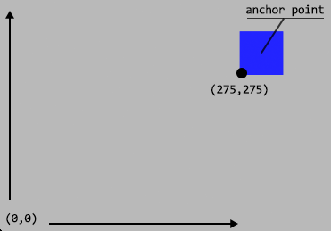

SpriteKit uses a grid of points to position nodes. In this grid, the bottom left corner of the scene is (0,0), with a positive X-axis to the right and a positive Y-axis to the top. Similarly, on the individual sprite level, (0,0) refers to the bottom left corner of the sprite, while (1,1) refers to the top right corner.

## Alignment with Anchor Points

Each sprite has an anchor point property, or an origin. The anchorPoint property allows you to choose which part of the sprite aligns to the sprite’s overall position.

**The default anchor point is (0.5,0.5), so new SKSpriteNodes center perfectly on their position.**

To illustrate this, let us examine a blue square sprite. Our sprite is 50 pixels wide and 50 pixels tall, and its position is (300,300). Since we have not modified the anchorPoint property, its anchor point is (0.5,0.5). This means the sprite will be perfectly centered over the (300,300) position on the scene’s grid. Our sprite’s left edge begins at 275 and the right edge terminates at 325. Likewise, the bottom starts at 275 and the top ends at 325. The diagram bellow illustrates our block’s position on the grid:

Why do we prefer centered sprites by default? You may think it simpler to position elements by their bottom left corner, with an anchorPoint setting of (0,0). However, the centered behavior benefits us when we scale or rotate sprites:

1. When we scale a sprite with an anchorPoint of (0,0) it will only expand up the y-axis and out the x-axis. Rotation actions will swing the sprite in wide circles around its bottom left corner.</li>
2. A centered sprite, with the default anchorPoint of (0.5, 0.5), will expand or contract equally in all directions when scaled and will spin in place when rotated, which is usually the desired effect.</li>

Still, there are some cases when you will want to change an anchor point. For instance, if you are drawing a rocket ship, you may want the ship to rotate around the front nose of its cone, rather than its center.

### Questions or ideas:

<a href="https://github.com/StephenHaney/stephenhaney/issues/2">Discuss this post on GitHub</a>
